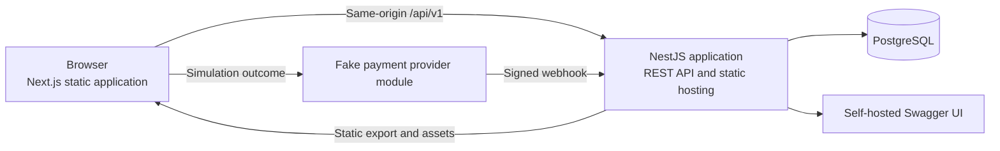
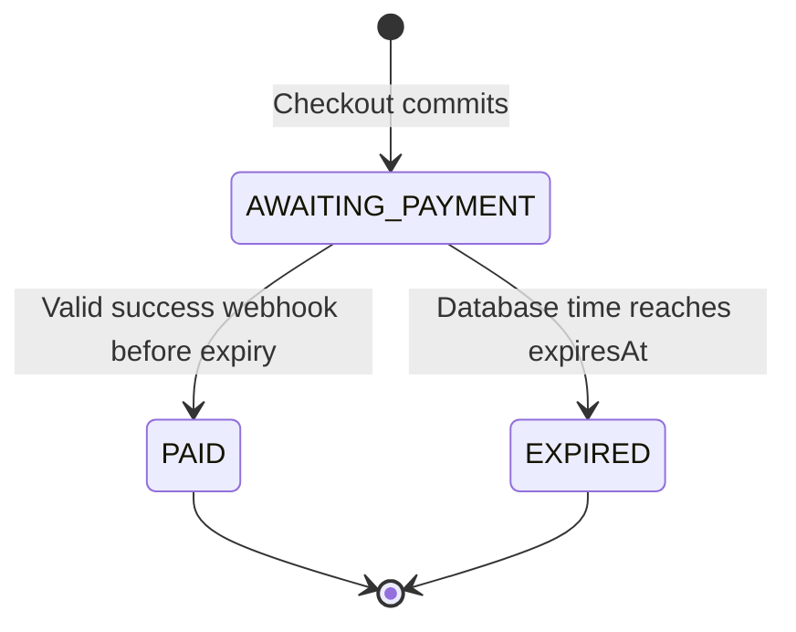

# Mini E-Commerce Fullstack Plan

Status: implementation-ready planning specification

Scope: planning only, no application source code

Domain glossary: [`CONTEXT.md`](../../CONTEXT.md)

Free-tier research: [`docs/research/free-no-card-stack.md`](../research/free-no-card-stack.md)

Implementation prompts: [`docs/agent-prompts.md`](../agent-prompts.md)

## 1. Goal

Build a mobile-first portfolio project that demonstrates an end-to-end purchase journey:

1. Browse and filter products.
2. Read product details and mostly static articles.
3. Maintain a Guest Cart.
4. Checkout with backend-authoritative price and inventory validation.
5. Create an awaiting-payment Order with a 15-minute inventory reservation.
6. Complete or fail a simulated payment through a signed webhook.
7. Observe an Order reaching `PAID` or `EXPIRED`.

The primary completion target is the fully verified local system. The optional public demo is deliberately disposable free-tier infrastructure.

## 2. Non-goals

- Customer accounts, login, or Guest-session recovery.
- Real card collection or real-money payment.
- Admin UI, CMS, uploads, transactional email, or stock-management UI.
- Wishlist, reviews, recommendations, promotions, multiple shipping methods, refunds, or fulfillment.
- Microservices, Redis, queues, cron services, Kubernetes, generic repositories, or speculative abstraction layers.

## 3. Technology baseline

| Concern | Selected technology | Cost and account requirement |
|---|---|---|
| Monorepo | pnpm workspaces | Open source, local |
| Frontend | Next.js, TypeScript, Tailwind CSS, TanStack Query | Open source, local |
| Backend | NestJS, TypeScript | Open source, local |
| Database | PostgreSQL | Open source, local |
| ORM and migrations | Prisma | Open source, local |
| API documentation | `@nestjs/swagger` and self-hosted Swagger UI | Open source, no hosted account |
| Browser testing | Playwright | Open source, local |
| Backend testing | Jest and PostgreSQL | Open source, local |
| Payment | Application-owned fake gateway | No account and no real payment data |
| Images | Licensed static repository assets | No storage account |
| Optional CI | GitHub Actions included allowance | No card required within current free allowance |
| Optional public compute | One Render Free Web Service | Currently free without a card |
| Optional public database | Neon Free PostgreSQL | Currently free without a card |

Install PostgreSQL natively for the strict local open-source path. A Compose file may be offered as an optional convenience for developers who already have an OCI-compatible container runtime. Docker Desktop is not a prerequisite.

No third-party free tier is guaranteed forever. If Render or Neon changes its terms, local operation remains the authoritative completion target and no automatic paid upgrade is allowed.

## 4. System architecture



### Local topology

- Run `apps/web` and `apps/api` as separate development processes.
- Proxy browser requests for `/api` to NestJS so cookies remain first-party.
- Run PostgreSQL locally with persisted data.
- Keep `/docs`, `/docs-json`, and `/health` on NestJS.

### Public demo topology

- Export Next.js as static files.
- Copy the export into the NestJS deploy artifact.
- Serve the frontend, API, Swagger, and fake-payment flow from one Render Web Service and one origin.
- Connect the runtime through Neon's pooled URL and migrations through its direct URL.
- Accept Render sleep and Neon scale-to-zero latency as an explicitly documented demo limitation.

The public deployment does not use Next.js runtime SSR, ISR, Server Actions, or runtime image optimization.

## 5. Intended repository shape

```text
apps/
  api/                 NestJS application
  web/                 Next.js static-export application
packages/
  content-fixtures/    deterministic Product and Article build/seed data
  api-types/           generated OpenAPI TypeScript types
docs/
  architecture/
  research/
prisma/                schema, migrations, and seed entry point
```

Keep packages few and purpose-specific. Do not introduce a generic domain, repository, utility, or shared-components package until demonstrated reuse requires it.

## 6. Domain model and invariants

### Core terms

- **Product** describes catalog content.
- **Product Variant** is the purchasable SKU and owns current price and available inventory.
- **Cart** is a Guest's current selection. It reserves nothing and guarantees no displayed price.
- **Checkout** is an idempotent process, not a database entity.
- **Order** is the immutable commercial snapshot accepted at checkout.
- **Inventory Reservation** is represented by quantities already decremented for an awaiting-payment Order.
- **Payment Attempt** is one attempt to pay an Order. An Order may have several before expiry.

### State machines



Payment Attempt states are `PENDING`, `SUCCEEDED`, `FAILED`, and `EXPIRED`. A failed attempt does not fail its Order. `PAID` and `EXPIRED` Orders are terminal.

### Money and totals

- Money is `{ amount: integer, currency: "IDR" }`.
- IDR amount is stored as integer rupiah.
- `subtotal = sum(unitPrice * quantity)`.
- `grandTotal = subtotal + regularShippingFee`.
- Prices are tax-inclusive.
- The browser never supplies an authoritative price, total, inventory value, or payment result.

### Checkout invariants

Checkout atomically:

1. Finds the Guest's active Cart and verifies its version.
2. Reads current active Variants in stable ID order.
3. Rejects the entire request when price, availability, or stock drifted.
4. Conditionally decrements every requested inventory quantity.
5. Creates the `AWAITING_PAYMENT` Order and immutable Order Items.
6. Sets `expiresAt` from database time plus 15 minutes.
7. Closes the submitted Cart and opens a new empty Cart.
8. Creates the idempotency record and initial pending Payment Attempt.

## 7. Persistence design

### Models

| Model | Essential fields and ownership |
|---|---|
| `GuestSession` | ID, opaque token hash, timestamps |
| `Product` | slug, name, description, category, image paths, active flag |
| `ProductVariant` | Product ID, SKU, option label, integer price, currency, available quantity, active flag |
| `Article` | slug, type, title, excerpt, sanitized HTML, image path, publication fields |
| `Cart` | Guest Session ID, `ACTIVE` or `CLOSED`, integer version, timestamps |
| `CartItem` | Cart ID, Product Variant ID, positive quantity |
| `Order` | Guest Session ID, status, customer/address snapshot, totals, currency, expiry, timestamps |
| `OrderItem` | Order ID, Variant reference, name/SKU/option/price snapshot, quantity, line total |
| `PaymentAttempt` | Order ID, status, provider reference, amount, currency, expiry, timestamps |
| `WebhookEvent` | unique provider event ID, event type, sanitized payload, received timestamp |
| `IdempotencyRecord` | Guest Session ID, key, request hash, Order ID, initial Payment Attempt ID |

There are no Checkout, Customer, reusable Address, Inventory, Reservation, audit-log, or soft-delete models in the MVP.

### Database constraints

- Unique Product slug, Article slug, SKU, Guest token hash, provider reference, and webhook event ID.
- Unique `(cartId, productVariantId)` and `(guestSessionId, idempotencyKey)`.
- PostgreSQL partial unique index for one active Cart per Guest.
- Positive quantities and non-negative prices, totals, fees, and available inventory.
- Restrictive history-preserving references for Orders, Order Items, and Payment Attempts.
- Focused indexes for catalog filters, publication date, Cart ownership, Order ownership/status/expiry, and Payment Attempt lookup.

### Transactions

Use four explicit transaction flows, not a generic Unit of Work:

1. **Cart mutation:** match active Cart and expected version, mutate one item, increment version.
2. **Checkout:** Prisma interactive transaction at PostgreSQL `Serializable`; retry Prisma conflict `P2034` at most three times.
3. **Expiry:** guarded transition from `AWAITING_PAYMENT` to `EXPIRED`, returning quantities in the same transaction.
4. **Webhook:** insert unique event, update Payment Attempt, and conditionally transition the Order in one transaction.

Network calls to the payment adapter occur only after a database transaction commits.

### Expiry trigger

Correctness cannot depend on a free cron service. Run an idempotent stale-Order reconciliation before:

- Order creation that needs inventory.
- Order status reads.
- Payment Attempt creation.

Only the transaction that changes an Order from `AWAITING_PAYMENT` to `EXPIRED` returns its inventory. A late webhook cannot revive it.

## 8. HTTP contract

### Conventions

- Business base path: `/api/v1`.
- Swagger UI: `/docs`.
- OpenAPI JSON: `/docs-json`.
- Health: `/health`.
- JSON success responses contain the resource directly.
- Collections use `{ items, pageInfo }`.
- Errors use `application/problem+json` based on RFC 9457.
- Times use ISO 8601 UTC strings.
- Enums use uppercase values.
- Unknown body and query fields are rejected.
- The response includes `X-Request-Id`.

### Shared representations

```text
Money
  amount: integer >= 0
  currency: IDR

PageInfo
  page: integer >= 1
  pageSize: integer 1..50
  totalItems: integer >= 0
  totalPages: integer >= 0

Problem
  type: URI
  title: string
  status: integer
  code: stable enum
  detail: safe human-readable string
  requestId: string
  errors?: field-level errors
  currentCart?: Cart
  order?: Order
  paymentAttempt?: PaymentAttempt
```

### Catalog and Article endpoints

| Method and path | Input | Success |
|---|---|---|
| `GET /api/v1/products` | `search?`, `category?`, `sort=newest\|price_asc\|price_desc`, `page=1`, `pageSize=20` | `200 ProductCollection` |
| `GET /api/v1/products/{slug}` | Product slug | `200 ProductDetail` |
| `GET /api/v1/articles` | `type=product\|news\|other`, `page=1`, `pageSize=20` | `200 ArticleCollection` |
| `GET /api/v1/articles/{slug}` | Article slug | `200 ArticleDetail` |

`ProductSummary` includes ID, slug, name, thumbnail, price range, and `IN_STOCK | LOW_STOCK | OUT_OF_STOCK`. `ProductDetail` adds description, images, and Variants with exact current price and available quantity.

`ArticleSummary` includes ID, slug, title, excerpt, cover image, type, and publication time. `ArticleDetail` adds sanitized `contentHtml`.

### Guest Cart endpoints

| Method and path | Required input | Success |
|---|---|---|
| `POST /api/v1/cart` | None | `200/201 Cart`, sets Guest cookie and `ETag` |
| `GET /api/v1/cart` | Guest cookie | `200 Cart` and `ETag` |
| `POST /api/v1/cart/items` | `If-Match`; `{ productVariantId, quantity }` | `200 Cart` and new `ETag` |
| `PATCH /api/v1/cart/items/{itemId}` | `If-Match`; `{ quantity }` | `200 Cart` and new `ETag` |
| `DELETE /api/v1/cart/items/{itemId}` | `If-Match` | `200 Cart` and new `ETag` |

The ETag is the quoted Cart version, such as `"4"`. Missing `If-Match` returns 428. A stale version returns 412 with `currentCart`. Adding an existing Variant increments its existing Cart Item.

The `guest_session` cookie is signed, HttpOnly, `SameSite=Lax`, `Path=/`, and `Secure` publicly. Only its token hash is stored.

### Order and payment endpoints

| Method and path | Required input | Success |
|---|---|---|
| `POST /api/v1/orders` | Guest cookie, `If-Match`, `Idempotency-Key`, checkout body | `201 OrderWithInitialPaymentAttempt` |
| `GET /api/v1/orders/{orderId}` | Guest cookie | `200 Order` |
| `POST /api/v1/orders/{orderId}/payment-attempts` | Guest cookie | `201 PaymentAttempt` |
| `POST /api/v1/fake-payments/{paymentAttemptId}/outcome` | Guest cookie, `{ outcome }` | `200 PaymentAttempt` |
| `POST /api/v1/webhooks/fake-payment` | Signed provider event | `200 acknowledgement` |

Checkout body contains only:

```json
{
  "customer": { "name": "Ada", "email": "ada@example.test" },
  "shippingAddress": {
    "line1": "Jl. Contoh 1",
    "city": "Jakarta",
    "postalCode": "10110",
    "countryCode": "ID"
  },
  "shippingMethod": "REGULAR"
}
```

The frontend sends no Cart ID, item list, price, shipping price, or total. An `Idempotency-Key` is 16 to 128 ASCII characters. Repeating the same key and canonical request hash returns the original resources; changing the payload with the same key returns 409.

If payment-session creation fails after Order commit, return a 502 Problem with the existing `order` and failed `paymentAttempt` extensions so the UI can navigate to Order status and retry. It must not invite a duplicate Checkout.

### Fake provider contract

The fake payment page offers deterministic `SUCCEEDED`, `FAILED`, and remain-`PENDING` outcomes. It collects no card-like data.

Signed webhook headers:

```text
X-Fake-Event-Id
X-Fake-Timestamp
X-Fake-Signature
```

The signature is HMAC SHA-256 over `timestamp.rawBody`. Verification uses a constant-time comparison, rejects timestamps older than five minutes, and deduplicates the provider event ID. The outcome endpoint acts as the provider and sends the signed webhook internally; the browser never calls the webhook directly.

### Error catalog

| Status | Codes |
|---|---|
| 400 | `MALFORMED_REQUEST` |
| 401 | `GUEST_SESSION_REQUIRED` |
| 404 | `PRODUCT_NOT_FOUND`, `ARTICLE_NOT_FOUND`, `CART_ITEM_NOT_FOUND`, `ORDER_NOT_FOUND` |
| 409 | `CHECKOUT_CART_CHANGED`, `INSUFFICIENT_STOCK`, `IDEMPOTENCY_KEY_REUSED`, `INVALID_ORDER_TRANSITION` |
| 412 | `CART_VERSION_MISMATCH` |
| 422 | `VALIDATION_FAILED` |
| 428 | `PRECONDITION_REQUIRED` |
| 502 | `PAYMENT_GATEWAY_UNAVAILABLE` |
| 500 | `INTERNAL_ERROR` |

A foreign Order is reported as `ORDER_NOT_FOUND`, not forbidden. Internal exceptions, secrets, and database details never appear in Problem Details.

### Validation limits

- Page starts at 1; page size is 1 to 50 and defaults to 20.
- Search is at most 100 characters.
- Cart quantity is 1 to 99.
- Name is 1 to 100 characters; email is valid and at most 254.
- Address line is at most 200; city at most 100; postal code is 3 to 12.
- Country is fixed to `ID` and shipping method to `REGULAR` for the MVP.
- JSON request bodies are limited to 64 KB.

### Cache policy

| Resource | Policy |
|---|---|
| Article GET | `public, max-age=300, stale-while-revalidate=86400` |
| Fingerprinted static assets | long-lived `immutable` |
| Product, Cart, Order, checkout, payment | `no-store` |
| Swagger JSON | `no-cache` |

## 9. Frontend architecture

### Routes and rendering

| Route | Rendering and data strategy |
|---|---|
| `/products` | Static shell, live API query, filters in URL |
| `/products/[slug]` | Build-known path, static shell, live Product query |
| `/articles` | Static generation from controlled fixtures |
| `/articles/[slug]` | Static generation from sanitized fixture content |
| `/cart` | Client-rendered Guest server state |
| `/checkout` | Client-rendered form and fresh Cart validation |
| `/order?orderId={uuid}` | Client-rendered runtime resource |
| `/fake-payment?paymentAttemptId={uuid}` | Client-rendered simulation |

Order and Payment Attempt IDs use query routes because Next.js static export cannot prebuild runtime UUID paths. Product and Article slugs are finite build-known fixture values.

### State ownership

| State | Owner |
|---|---|
| Product search, category, sort, page | URL search parameters |
| Product, Cart, Order, Payment Attempt | TanStack Query |
| Selected Variant, drawer, dialog, form draft | Local React state |
| Guest identity | Signed HttpOnly cookie |
| Active checkout idempotency key | `sessionStorage` until definitive outcome |

Do not add Redux, Zustand, Axios, React Hook Form, or a duplicated runtime schema layer. Use native fetch, generated OpenAPI types, HTML validation for early feedback, and backend validation as the authority.

### Reconciliation rules

- Bootstrap a Cart only when opening it or adding the first item. A passive header lookup that gets 401 shows badge zero without creating a Cart.
- Do not optimistically change Cart quantity, inventory, price, or totals.
- Send `If-Match`, disable only the affected control, then replace the cached Cart with the server response and new ETag.
- On 412, replace state with `currentCart` and explain the concurrent update.
- On checkout drift, show the refreshed Cart and require explicit reconfirmation.
- Generate one checkout idempotency key per Cart/version/input intent and reuse it across network retries.
- Poll awaiting Orders every two seconds while the tab is visible. Stop at a terminal state or after two minutes, then expose manual refresh.

### UI state requirements

Every server-state view has explicit loading, empty, recoverable error, and not-found handling. Commerce screens additionally cover out-of-stock, stale Cart, insufficient stock, payment failure, awaiting payment, paid, and expired states.

Use inline messages for actionable problems and short live-region notifications for non-critical confirmations. Do not use a toast as the only presentation of checkout or payment failure.

### Mobile and accessibility

- Begin at 375 px and avoid horizontal overflow.
- Use a mobile filter drawer and desktop filter sidebar.
- Keep checkout single-column on mobile.
- Provide at least 44 by 44 px interactive targets.
- Use semantic landmarks, ordered headings, explicit labels, and visible focus.
- Connect field errors through `aria-describedby` and focus an error summary after failed submit.
- Announce Cart and payment changes with an appropriate `aria-live` region.
- Keep drawers and dialogs keyboard-operable and honor reduced-motion preference.

## 10. Security baseline

- Same-origin browser and API publicly; no permissive production CORS.
- Validate `Origin` on unsafe browser methods.
- Use signed, secure Guest cookies and store only the token hash.
- Whitelist DTO fields, reject unknown values, and cap body size.
- Authorize every Cart and Order through the Guest Session.
- Conceal resource existence across Guest boundaries.
- Verify webhook timestamp, HMAC, event uniqueness, and terminal-state guard.
- Never log cookies, complete email/address data, secrets, signatures, full idempotency keys, or connection URLs.
- Dependency audit is informational. Never run forced automatic dependency upgrades.

## 11. Verification strategy

### Unit checks

- Money and Cart total calculation.
- Order transition rules.
- Expiry eligibility using database-time inputs.
- HMAC signing and constant-time verification.

### PostgreSQL integration checks

- Guest cookie creation and ownership isolation.
- ETag success, missing precondition, and stale Cart reconciliation.
- Server-authoritative price and total snapshots.
- Same-key idempotent replay and changed-payload conflict.
- Two concurrent checkouts competing for the last stock unit.
- Expiry returns stock exactly once.
- Duplicate, invalid, late, and successful payment webhooks.
- Race between expiry and payment produces one terminal outcome.

### Playwright journeys

1. Filter PLP through URL state, open PDP, and add a Variant.
2. Change Cart quantity and confirm consistency after refresh.
3. Checkout, simulate payment success, and observe `PAID`.
4. Simulate failure, retry on the same Order, then succeed.
5. Reconcile a Cart or inventory change during Checkout.

Run keyboard smoke checks and axe scans on PLP, PDP, Article Detail, Cart, Checkout, Order, and Fake Payment. Check 375x667, 768x1024, and 1440x900 viewports.

### CI gate

Run in this order:

1. Frozen dependency install.
2. Format check.
3. Lint.
4. Typecheck.
5. Test database migration.
6. Backend unit and integration tests.
7. Generate OpenAPI and frontend types, then require a clean diff.
8. Production build and static export.
9. Critical Playwright journeys.

Do not enforce a global coverage percentage. Require tests around business risks and add a regression test whenever a real defect is fixed.

## 12. Seed and configuration

Use deterministic Product, Variant, and Article fixtures with stable slugs and SKUs. Development has an explicit destructive reset command; tests reset only the isolated test database; public startup runs an idempotent `seed-if-empty` operation.

Required environment variables:

```text
NODE_ENV
PORT
DATABASE_URL
DIRECT_URL
COOKIE_SECRET
FAKE_PAYMENT_WEBHOOK_SECRET
PUBLIC_BASE_URL
```

Commit only `.env.example`. Never commit real values.

## 13. Public demo preparation

The single-service startup order is:

```text
prisma migrate deploy
seed-if-empty
start NestJS
```

Deployment acceptance:

- `/health` recovers after a cold start and reports database connectivity without details.
- `/docs` and `/docs-json` are reachable.
- Direct Product and Article URLs do not return 404.
- Guest cookie, Cart, checkout, fake webhook, and `PAID` transition work.
- Static route refreshes work without custom-origin or CORS errors.
- Order data remains after service sleep.
- No process writes persistent business data to Render's ephemeral filesystem.

Preparing deployment configuration does not authorize an agent to create accounts, push, or deploy.

## 14. Implementation sequence

| Phase | Result |
|---|---|
| 00 | pnpm workspace, app shells, scripts, local environment contract |
| 01 | Prisma schema, migrations, deterministic fixtures and seed |
| 02 | NestJS API conventions, session, errors, Swagger, generated types |
| 03 | Product and Article read APIs |
| 04 | Guest Cart API with ETag concurrency |
| 05 | Checkout, Order snapshot, inventory transaction and expiry |
| 06 | Fake gateway, Payment Attempts and signed webhook |
| 07 | Frontend shell, API client, Query provider and UI primitives |
| 08 | Product and Article frontend |
| 09 | Cart frontend and reconciliation |
| 10 | Checkout, fake payment and Order frontend |
| 11 | Integrated tests, accessibility and responsive verification |
| 12 | Single-service public deployment preparation |
| 13 | Final architecture, security, scope and documentation review |

Run the phases sequentially. Perform dedicated reviews after phases 01, 02, 05, 06, and 13.

## 15. Definition of Done

A phase is complete only when:

- Its exact scope and acceptance criteria are satisfied.
- Relevant tests, lint, typecheck, and build checks pass.
- OpenAPI and generated frontend types remain synchronized when touched.
- No unrelated refactor, secret, provider change, or unapproved production dependency appears.
- Relevant documentation is current.
- The handoff lists changed files, checks run, and any check that could not run with its reason.

## 16. Explicit tradeoffs and upgrade triggers

| Current simplification | Upgrade only when |
|---|---|
| Lazy expiry reconciliation | Orders must expire without any incoming request |
| Single `availableQuantity` counter | Receiving, adjustments, fulfillment, or multiple locations are added |
| Page-number pagination | Catalog size or write frequency makes deep pages problematic |
| Case-insensitive Product search | Relevance, typo tolerance, or large catalog demands real search |
| Guest-only ownership | Account recovery or cross-device history is required |
| Static repository images | User-managed uploads become a product requirement |
| One Render service | Reliability or independent scaling becomes more important than free operation |
| Fake payment adapter | Real payment and its compliance work are explicitly authorized |

These are deliberate MVP boundaries, not placeholders for speculative infrastructure.
